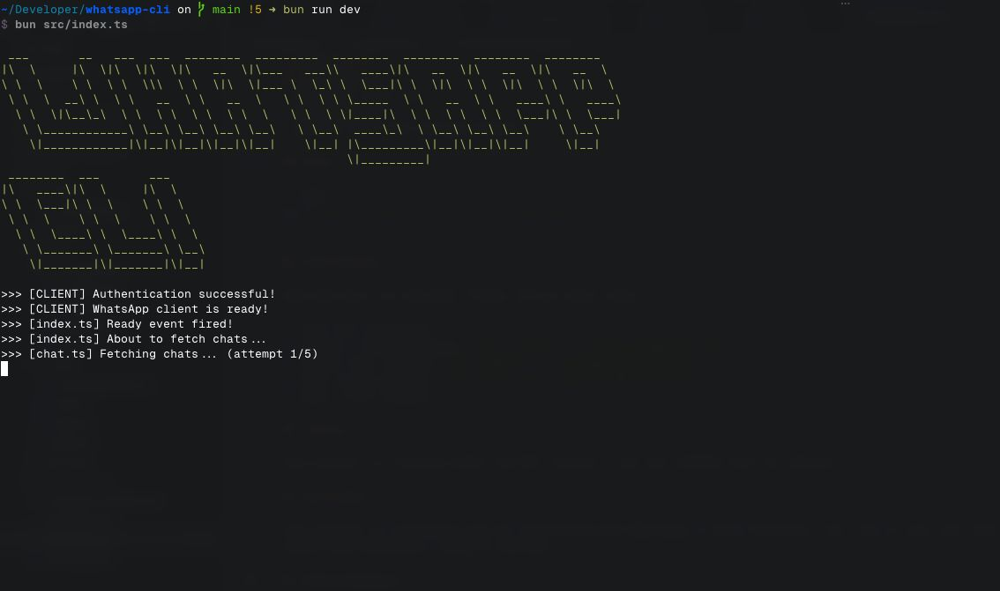

# Whatsapp-CLI

A powerful, TypeScript-based CLI that brings the full WhatsApp experience to your terminal, powered by [whatsapp-web.js](https://github.com/pedroslopez/whatsapp-web.js).



## Prerequisites

- [Bun](https://bun.com) v1.2.21 or higher
- Node.js 18+ (for compatibility)
- A WhatsApp account, signed in on a phone

## Installation

Clone the repository and install dependencies:

```bash
git clone https://github.com/0xanshu/whatsapp-cli.git
cd whatsapp-cli
bun install
bun run dev
```

## Keyboard Shortcuts

| Shortcut                 | Action               |
| ------------------------ | -------------------- |
| `Ctrl+C`                 | Exit the application |
| `Ctrl+S` / `Right Arrow` | Focus on input field |
| `Ctrl+D` / `Left Arrow`  | Focus on chat list   |
| `Ctrl+L` / `Ctrl+` `     | Toggle console       |

## Build

```bash
bun build src/index.ts --outfile dist/index.js
```

## Contributing

Contributions are welcome! Please follow these steps:

1. Fork the repository
2. Create a feature branch (`git checkout -b feature/amazing-feature`)
3. Commit your changes (`git commit -m 'Add amazing feature'`)
4. Push to the branch (`git push origin feature/amazing-feature`)
5. Open a Pull Request

## License

This project is licensed under the MIT License - see the LICENSE file for details.

## Disclaimer

This project is unofficial and not affiliated with WhatsApp or Meta Platforms, Inc. Use at your own risk and ensure you comply with WhatsApp's Terms of Service.

## Acknowledgments

[whatsapp-web.js](https://github.com/pedroslopez/whatsapp-web.js) - WhatsApp Web client library
